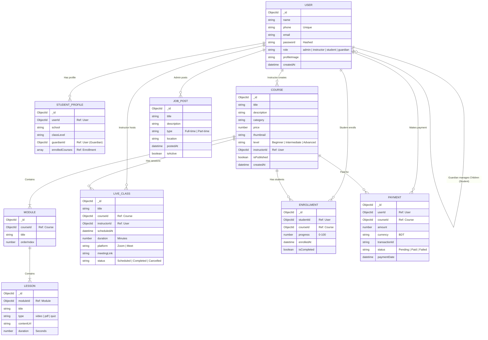

# 📊 Learn & Grow - Entity Relationship (ER) Diagram

Based on the current frontend features (Dashboards for Admin, Instructor, Student, Guardian) and the mock data structures, here is the recommended database schema design for your MongoDB backend.

## 📝 Detailed Entity Explanations & Logic

### 1. 👤 User (Collection: `users`)
The `User` collection is the heart of the application, storing authentication and profile data for all role types.
*   **Authentication:**
    *   `phone`: The primary unique identifier for login (as per your requirement).
    *   `password`: Stored as a generic Bcrypt hash.
*   **Role Management (`role` field):**
    *   `admin`: Full access to `JobPost`, `User` management, and Site Settings.
    *   `instructor`: Can create `Courses`, schedule `LiveClasses`, and view their own `Earnings`.
    *   `student`: Can `Enroll` in courses, view content, and join classes.
    *   `guardian`: Read-only access to their connected `Student`'s progress.
*   **Guardian-Student Logic:**
    *   A **Guardian** user document will contain an array of `children`, where each item is the `ObjectId` of a **Student** user. This allows one parent to track multiple children.

### 2. 📚 Course Structure (Collections: `courses`, `modules`, `lessons`)
We use a **Reference Pattern** (or Hybrid) to structure courses efficiently.
*   **Course (Parent):** Contains high-level metadata:
    *   `instructorId`: Who owns this course? (Used for calculating earnings).
    *   `category`: For filtering on the homepage (e.g., "Web Dev", "Robotics").
    *   `thumbnail`: URL to the cover image.
*   **Module (Child of Course):** Represents a "Section" or "Week" (e.g., "Week 1: Basics").
    *   `courseId`: Links it back to the parent course.
    *   `orderIndex`: Determines the sorting order (1, 2, 3...) in the UI.
*   **Lesson (Child of Module):** The actual content.
    *   `type`: Determines which player to render (Video Player, PDF Viewer, or Quiz Interface).
    *   `contentUrl`: The link to the file (hosted on AWS S3, Vimeo, or local uploads).

### 3. 🎥 Live Classes (Collection: `live_classes`)
Live classes are dynamic events scheduled by Instructors.
*   **Scheduling Logic:**
    *   An instructor selects a `Course` when creating a class.
    *   This automatically makes the class visible to **all students actively enrolled** in that specific course.
*   **Status Workflow:**
    *   `scheduled`: The class is upcoming. "Join" button is disabled or shows a countdown.
    *   `ongoing`: The class is live now. "Join" button opens the Zoom/Meet link.
    *   `completed`: Class is over. The link might be replaced by a `recordingUrl` (future feature).

### 4. 🎓 Enrollment vs. 💰 Payment
Why separate them? To support free courses, manual enrollments, and better data integrity.
*   **Payment (`payments`):**
    *   This is a financial ledger. It records *transactions* (e.g., "User X paid 500 BDT").
    *   It stores external gateway data like `transactionId` and `paymentMethod`.
*   **Enrollment (`enrollments`):**
    *   This is an academic record. It records *access* (e.g., "User X has access to Course Y").
    *   **Trigger:** When a `Payment` status becomes `paid`, the backend automatically creates an `Enrollment` document.
    *   **Progress Tracking:** The `progress` field (0-100) is updated as students mark lessons as complete.

### 5. 🛠️ Implementation Notes for MongoDB
*   **Indexing:**
    *   Create a unique index on `users.phone` to prevent duplicate accounts.
    *   Index `courses.instructorId` for fast lookup of "My Courses".
    *   Index `enrollments.studentId` + `enrollments.courseId` to quickly check "Is this user allowed to view this course?".
*   **Relationships:**
    *   Use Mongoose `populate()` to fetch related data (e.g., `Enrollment.find().populate('courseId')` to show course details on the dashboard).
